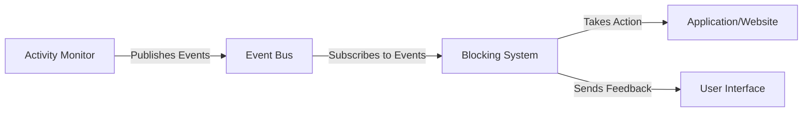

# Focus Guard Blocking System Refactoring Plan

**Document Version**: 2.0  
**Last Updated**: 2025-09-09  
**Status**: Work In Progress  
**Team**: Focus Guard Development Team

## Overview
This document outlines the plan to refactor the blocking functionality in Focus Guard to eliminate duplication, improve architectural clarity, and create a more maintainable codebase.

## Integration with Activity Monitoring

The blocking system will integrate with the Activity Monitoring module through a well-defined event system:



### Key Integration Points
1. **Event Subscription**
   - Window focus changes
   - Application launches
   - Browser tab updates
   - User idle/active state changes

2. **Feedback Loop**
   - Blocking decisions sent to UI
   - User override requests
   - Policy violation notifications

## Current Issues

1. **Duplicated Functionality**
   - Blocking logic exists in multiple places:
     - `/core/blocking/` (general domain blocking)
     - `/core/activity/blocking/` (application and domain blocking)
     - `/core/activity/browser/` (browser-specific blocking)

2. **Architectural Confusion**
   - Mixing of monitoring and blocking concerns
   - Inconsistent policy evaluation across modules
   - Multiple entry points for similar functionality

3. **Maintenance Challenges**
   - Changes need to be made in multiple places
   - Inconsistent behavior between different blocking implementations
   - Difficult to test and verify behavior

## Target Architecture

### 1. Core Blocking Module (`/core/blocking/`)

This module handles all blocking-related functionality and integrates with the activity monitoring system through events.

```
/core/blocking/
├── __init__.py
├── base.py                 # Core interfaces
├── policies/               # Policy definitions
│   ├── __init__.py
│   ├── base.py
│   ├── time_based.py
│   └── domain.py
├── strategies/             # Blocking implementations
│   ├── __init__.py
│   ├── domain.py
│   ├── application.py
│   └── browser.py
├── engine.py               # Policy engine
└── events.py               # Events and decisions
```

### 2. Activity Module (`/core/activity/`)

This module focuses solely on monitoring and event generation, with no blocking logic.

```
/core/activity/
├── monitoring/            # Monitoring only
│   ├── __init__.py
│   ├── base.py
│   ├── application.py
│   └── browser.py
└── integration/           # Integration with blocking
    ├── __init__.py
    └── activity_blocker.py
```

### Browser Module (`/core/browser/`)

```
/core/browser/
├── monitoring/           # Browser monitoring
│   └── tab_monitor.py
└── blocking/             # Browser-specific blocking
    ├── __init__.py
    ├── domain.py
    └── tab_blocker.py
```

## Implementation Phases

### Phase 1: Core Blocking Consolidation (Week 1-2)

1. **Define Integration Points**
   - Create event schema for activity monitoring
   - Implement event handlers in blocking system
   - Set up cross-module communication

2. **Update Core Interfaces**
   - Define `BlockingStrategy` and `BlockingPolicy` interfaces
   - Create unified `BlockingDecision` model
   - Implement policy evaluation engine

3. **Migrate Common Functionality**
   - Move shared blocking logic to core module
   - Create adapters for existing implementations
   - Implement unified event system

1. **Create Core Interfaces**
   - Define `BlockingStrategy` and `BlockingPolicy` base classes
   - Create unified `BlockingDecision` model
   - Implement policy evaluation engine

2. **Migrate Common Functionality**
   - Move shared blocking logic to core module
   - Create adapters for existing implementations
   - Implement unified event system

3. **Update Dependencies**
   - Update imports across the codebase
   - Ensure backward compatibility

### Phase 2: Activity Module Refactoring (Week 3-4)

1. **Remove Blocking Logic**
   - Extract blocking-related code to core module
   - Update event publishing system
   - Ensure clean separation of concerns

2. **Enhance Event System**
   - Define standard activity event schema
   - Implement event filtering and aggregation
   - Add support for custom event processors

3. **Update Dependencies**
   - Remove blocking-related dependencies
   - Update imports and references
   - Ensure backward compatibility

1. **Separate Monitoring and Blocking**
   - Move monitoring code to `/core/activity/monitoring/`
   - Update activity monitoring to use new blocking system
   - Deprecate old blocking code

2. **Update Integration Points**
   - Modify activity system to use new blocking APIs
   - Update event handling
   - Ensure proper error handling

3. **Testing**
   - Update unit tests
   - Add integration tests
   - Verify backward compatibility

### Phase 3: Browser Integration (Week 5-6)

1. **Update Browser Monitoring**
   - Move browser monitoring to activity module
   - Implement tab-level event publishing
   - Ensure efficient event handling

2. **Enhance Blocking Capabilities**
   - Implement browser-specific blocking strategies
   - Add support for tab-level blocking
   - Update policy evaluation for web content

1. **Refactor Browser Monitoring**
   - Move browser monitoring to `/core/browser/monitoring/`
   - Update tab monitoring to use new system
   - Implement browser-specific blocking strategies

2. **Update Comprehensive Activity System**
   - Modify to use new blocking architecture
   - Ensure proper event propagation
   - Update configuration handling

3. **Testing and Validation**
   - Test browser integration
   - Verify blocking behavior
   - Performance testing

## Migration Strategy

1. **Incremental Changes**
   - Make changes in small, testable increments
   - Maintain backward compatibility during transition
   - Use feature flags for major changes

2. **Deprecation Policy**
   - Mark old code as deprecated
   - Provide migration guides
   - Remove deprecated code in a future version

3. **Testing Strategy**
   - Unit tests for new components
   - Integration tests for critical paths
   - End-to-end tests for user workflows

## Integration Testing Strategy

### Test Scenarios
1. **Basic Monitoring**
   - Verify activity events are properly generated
   - Test idle detection and state changes
   - Validate event data structure

2. **Blocking Integration**
   - Test blocking decisions based on activity
   - Verify policy evaluation
   - Test override mechanisms

3. **Performance Testing**
   - Measure impact on system resources
   - Test with high event volumes
   - Verify memory usage patterns

## Risk Assessment

| Risk | Impact | Mitigation |
|------|--------|------------|
| Breaking changes | High | Maintain backward compatibility, provide migration guides |
| Performance impact | Medium | Profile critical paths, optimize as needed |
| Integration issues | High | Comprehensive testing, feature flags |
| Data loss | Critical | Backup existing configuration, implement migration scripts |

## Success Metrics

1. **Code Quality**
   - Reduced code duplication
   - Improved test coverage
   - Better separation of concerns

2. **Performance**
   - No degradation in blocking performance
   - Reduced memory usage
   - Faster policy evaluation

3. **Maintainability**
   - Clearer architecture
   - Better documentation
   - Easier to add new features

## Implementation Details

### Code Organization

#### Core Blocking Module (`/focus_guard/core/blocking/`)
- `base.py`: Core interfaces and abstract base classes
- `pipeline.py`: Blocking pipeline implementation
- `strategies/`: Directory for blocking strategies
  - `category_blocker.py`: Block by content category
  - `domain_excluder.py`: Domain-based blocking
  - `registry.py`: Strategy registration system

#### Migration Targets
- Move from `/core/activity/blocking/` to core blocking module:
  - `application_blocker.py` → `strategies/application_blocker.py`
  - `policy_engine.py` → `policy/engine.py`
  - `models.py` → `models/blocking_models.py`
  - `notification_manager.py` → `notification/manager.py`

### Data Flow

1. **Event Generation** (Activity Module)
   - Activity monitoring detects events (app focus, URL change, etc.)
   - Publishes events to event bus with relevant context

2. **Event Processing** (Blocking Module)
   - Event listeners in blocking module receive events
   - Policy engine evaluates applicable rules
   - Blocking strategies are executed based on policy decisions

3. **Action Execution**
   - Blocking actions (close tab, show warning, etc.)
   - Notification delivery
   - Logging and metrics collection

### Common Scenarios and Solutions

#### 1. Handling Cross-Module Dependencies
```python
# Instead of direct imports between modules, use event-based communication
# Before (tight coupling):
# from focus_guard.core.activity.blocking import BlockingSystem

# After (event-based):
event_bus.subscribe(EventTypes.URL_NAVIGATION, self._handle_url_navigation)
```

#### 2. Policy Migration Strategy
1. Create adapters for existing policies
2. Implement dual-write during transition
3. Add migration validation
4. Phase out old implementation

### Performance Considerations
- Cache policy evaluation results
- Batch process events when possible
- Use efficient data structures for URL/domain matching
- Implement rate limiting for notifications

## Next Steps

1. **Environment Setup**
   - Create feature branch: `feature/blocking-refactor`
   - Set up test environment with mock event bus
   - Configure CI/CD for the new module

2. **Implementation Phases**
   - Phase 1a: Core blocking infrastructure (2 weeks)
   - Phase 1b: Policy engine migration (1 week)
   - Phase 1c: Integration with activity module (1 week)

3. **Testing Strategy**
   - Unit tests for each strategy
   - Integration tests with event bus
   - Performance testing with 10k+ rules
   - Browser compatibility testing

4. **Rollout Plan**
   - Canary release to 10% of users
   - Feature flag for gradual rollout
   - Rollback plan in place

## Related Documents

- [Activity Module Improvement Plan](./ACTIVITY_MODULE_IMPROVEMENT_PLAN.md)
- [Blocking System Design](../design/blocking_system_design.md)
- [Migration Guide](../migration/blocking_system_migration.md)
- [Event Bus Architecture](../architecture/event_bus.md)
- [Performance Benchmarks](../testing/performance/blocking_benchmarks.md)

## Appendix: Common Refactoring Patterns

### 1. Moving from Direct Calls to Events
```python
# Before (direct call):
class ActivityMonitor:
    def on_url_change(self, url):
        if blocking_system.should_block(url):
            blocking_system.block(url)

# After (event-based):
class ActivityMonitor:
    def on_url_change(self, url):
        event_bus.publish(URL_NAVIGATION, {
            'url': url,
            'timestamp': datetime.utcnow(),
            'context': self.get_context()
        })
```

### 2. Policy Migration Example
```python
# Legacy policy format (activity/blocking/models.py)
class BlockingPolicy:
    def __init__(self, name, action, patterns):
        self.name = name
        self.action = action
        self.patterns = patterns

# New format (blocking/models/policy.py)
@dataclass
class BlockingRule:
    name: str
    action: BlockingAction
    patterns: List[URLPattern]
    priority: int = 0
    conditions: List[Callable[[Event], bool]] = field(default_factory=list)
```

### 3. Testing Strategy
```python
class TestBlockingIntegration:
    @pytest.fixture
    def blocking_system(self):
        return BlockingSystem(event_bus)
    
    def test_url_blocking(self, blocking_system):
        # Setup test policy
        policy = BlockingPolicy("test", BlockingAction.BLOCK, ["*.example.com"])
        blocking_system.add_policy(policy)
        
        # Simulate URL navigation
        event_bus.publish(URL_NAVIGATION, {"url": "http://test.example.com"})
        
        # Verify blocking action was taken
        assert mock_browser.was_blocked("http://test.example.com")
```

---
*Last Updated: 2025-09-09*
*Version: 1.0*
