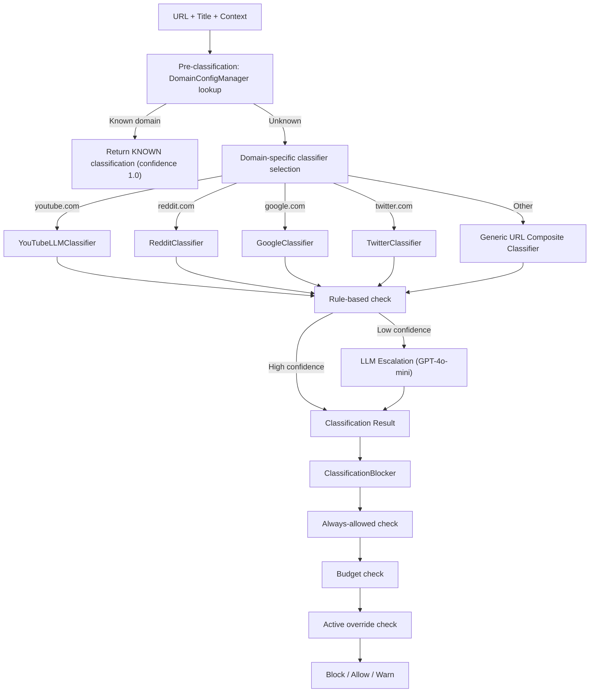
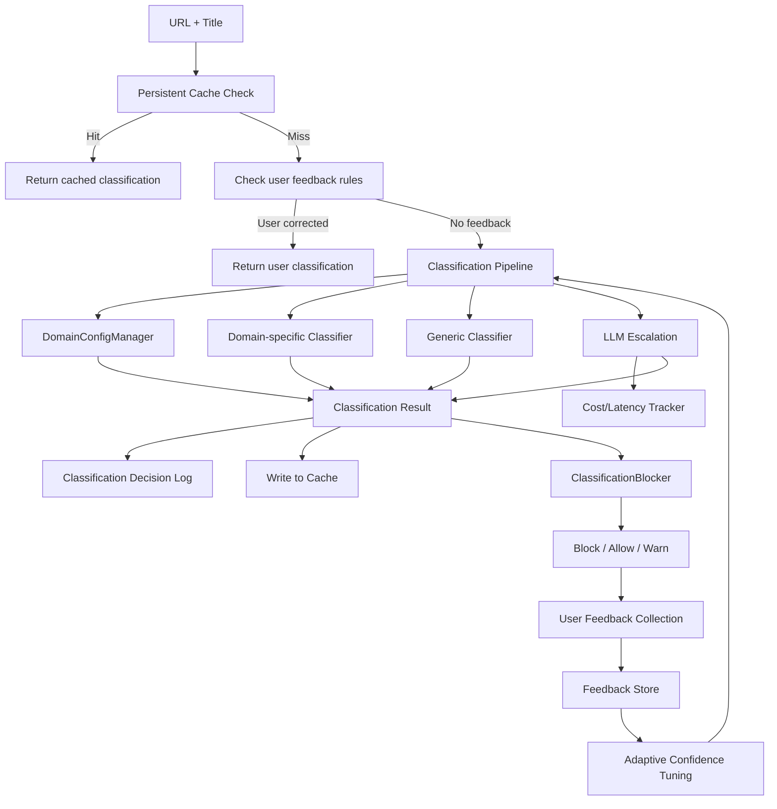

# FocusGuard MVP Session Plan -- Feb 22, 2026

## Current State After Previous Sessions

The Windsurf session (Feb 22) completed significant work:

- Dashboard hero redesign (focus score ring, summary, budget bar, alerts)
- Nav renamed ("Rules & Overrides", Saved Links in nav)
- Activity logger wired into `main.py` (was only in service.py path)
- App activity tab with date range filters
- Per-category budget sliders, per-domain budget editing, email config enhancements
- BUG-021 fix (domains page: frontend/backend contract mismatches)

**But none of this is runtime-verified** -- the exe was NOT rebuilt, so all fixes exist only in source.

Open bugs: BUG-021 (domains, claimed fixed), BUG-022 (activity tab empty), BUG-023 (email reports blank), BUG-012 (devices page error), BUG-010 (classification false positives).

---

## Phase 0: Verify & Stabilize (Do First)

### 0.1 Audit the Windsurf changes for correctness

Before rebuilding, review the key files modified by the Windsurf session for any issues:

- [server.py](focus_guard/core/browser_v2/tab_server/server.py) -- domain endpoints, activity handler
- [settings_service.py](focus_guard/core/admin_gateway/services/settings_service.py) -- budget transforms, test email
- [Settings.tsx](admin_ui/src/views/Settings.tsx) -- category labels, email recipients
- [AppActivity.tsx](admin_ui/src/views/AppActivity.tsx) -- date range, daily breakdown

### 0.2 Build admin UI + rebuild exe

```powershell
cd admin_ui && npm run build
cd C:\Users\prasun_agarwal\focus_guard
python -m PyInstaller --clean deployment/application/windows/specs/focusguard_unified.spec
```

### 0.3 Runtime verification checklist

- Start FocusGuard.exe, open `http://127.0.0.1:58393/admin`
- Verify domains page loads without error (BUG-021)
- Verify app activity tab shows real data (BUG-022) -- expect Cursor/Windsurf usage
- Wait for next hourly email and verify it has content (BUG-023)
- Test enforcement mode toggle with password
- Test creating/revoking an override
- Check dashboard hero section renders properly

---

## Phase 1: Email Report Enhancements (MVP-Critical)

These are high-value, low-effort items that directly improve the parent experience.

### 1.1 Add admin console link to email (W-01) -- 30 min

- File: [email_reporter.py](focus_guard/deployment/email_reporter.py)
- Add `http://127.0.0.1:58393/admin` link in email body
- Include a note: "Open your FocusGuard dashboard to see detailed activity"

### 1.2 Add health check link with zero-activity warning (W-04) -- 30 min

- File: [email_reporter.py](focus_guard/deployment/email_reporter.py)
- When `active_time == 0`, add: "No activity detected. If you believe this is incorrect, check FocusGuard status at [link]"

### 1.3 Richer email content (W-06) -- 2-3h

- File: [email_reporter.py](focus_guard/deployment/email_reporter.py)
- Add to email body: top apps used, top domains visited, blocked site attempts, override usage
- Data is already available from the three-tier query strategy (`activity_samples` -> `usage_sessions` -> `visible_windows`)
- Add focus score calculation (reuse logic from `_handle_get_popup_context` in server.py)

### 1.4 Support multiple email recipients (W-05) -- 1-2h

- Files: [email_reporter.py](focus_guard/deployment/email_reporter.py), [settings_service.py](focus_guard/core/admin_gateway/services/settings_service.py)
- The Windsurf session already added UI for comma-separated recipients
- Verify backend `deployment_config.json` schema supports a list
- Update SMTP send logic to iterate over recipients

---

## Phase 2: Admin Console UX (MVP-Critical)

### 2.1 Fix BUG-012: Devices page runtime error -- 1h

- **Clarification**: The backend [devices_service.py](focus_guard/core/admin_gateway/services/devices_service.py) already has defensive handling for BUG-012: it coerces `health`, `status`, and `enforcement` so the frontend always receives a valid list shape (never assumes they are dicts). If the devices page still fails at runtime, the issue is likely **(a)** frontend `Devices.tsx` expecting a different response shape (e.g. array vs single-device wrapper), or **(b)** a different contract mismatch (e.g. field names or nesting). First step: confirm whether the failure is in the admin gateway response shape or in the tab server `/api/health` / `/api/status` raw response.
- Files: [admin_ui/src/views/Devices.tsx](admin_ui/src/views/Devices.tsx) (if it exists), [devices_service.py](focus_guard/core/admin_gateway/services/devices_service.py)
- Debug contract mismatch between frontend and admin gateway `/api/status` (or tab server) response

### 2.2 Fix BUG-015: Friction/override readability -- 1h

- File: [Dashboard.tsx](admin_ui/src/views/Dashboard.tsx)
- Replace "friction domains" with "Problem Sites"
- Format durations as human-readable ("5 minutes" not "300 seconds")
- Filter out synthetic/internal domains from display

### 2.3 Activity timeline (Phase A3) -- 3-4h

- Backend: Add `GET /api/activity/timeline?date=YYYY-MM-DD` returning hourly buckets with category breakdown
- Frontend: Horizontal bar chart in Dashboard showing hour-by-hour activity, color-coded by category
- Key files: [Dashboard.tsx](admin_ui/src/views/Dashboard.tsx), [dashboard_service.py](focus_guard/core/admin_gateway/services/dashboard_service.py)

### 2.4 Date/time range selector on dashboard (Phase A5) -- 2h

- Add date picker with presets (Today, Yesterday, This Week)
- Wire `start_date`/`end_date` query params through to dashboard aggregation
- Windsurf already added this to the activity tab; adapt the pattern for the main dashboard

### Tier 3 remaining (from prior session 07/10)

- **A3**: Activity timeline — already covered in §2.3 (hourly bar chart, `GET /api/activity/timeline`).
- **A4**: Collapsible detail sections — add expand/collapse to dashboard or activity detail sections so power users can drill down without clutter. Estimate: 2h.

### Tier 4 — deferred (from prior session 07/10)

- Merge Devices into Dashboard (single view instead of separate Devices page).
- Dedicated Activity page (full-page activity view vs tab).
- Alerts page (dedicated UI for app/provider alerts).
- Override UX: human-friendly time inputs (e.g. "30 minutes" instead of raw seconds).

---

## Phase 3: Blocked Page & Extension (MVP-Critical)

### 3.1 Budget context on blocked page (W-60 / BUG-018) -- 2h

- Files: [blocked.js](focus_guard/core/browser/extension/webextension_mv3/blocked.js), [server.py](focus_guard/core/browser_v2/tab_server/server.py)
- Based on the exploration, the blocked page **already shows** master distraction budget and per-domain usage stats
- **Verify this works at runtime** -- the UI code exists but may not be getting data from the API
- If not working, trace the data path from `_handle_get_distraction_budget()` and `_handle_get_popup_context()`

### 3.2 Extension polling optimization (W-42) -- 1-2h

- File: [background.js](focus_guard/core/browser/extension/webextension_mv3/background.js)
- Replace 5-second `setInterval` polling with event listeners: `chrome.tabs.onUpdated`, `onCreated`, `onRemoved`, `onActivated`
- Keep 30-second heartbeat for connection monitoring
- This reduces extension traffic by ~90% (from 720 req/hr to ~72 req/hr)
- **Note**: Requires extension store re-submission after change

### 3.3 Classification feedback from blocked page (W-40, partial) -- 2h

- File: [blocked.html](focus_guard/core/browser/extension/webextension_mv3/blocked.html), [blocked.js](focus_guard/core/browser/extension/webextension_mv3/blocked.js), [server.py](focus_guard/core/browser_v2/tab_server/server.py)
- Add "This is actually educational" button on blocked page
- Store feedback via new `POST /api/classification/feedback` endpoint
- This is the first step of the feedback loop (collection); ingestion comes in Phase 4

---

## Phase 4: Classification & Blocking Pipeline -- Detailed Roadmap

This is the core strength of FocusGuard and needs to be robust, intelligent, scalable, and self-improving. The current pipeline is functional but has significant gaps.

### Current Architecture




### Key Weaknesses Identified

1. **No learning/feedback loop** -- misclassifications are never corrected
2. **In-memory cache only** -- lost on restart, 100 entries, 5-min TTL
3. **Hardcoded domain lists** -- Reddit subreddits, Twitter accounts not user-configurable
4. **No cost/latency tracking** -- LLM usage unmonitored
5. **No confidence calibration** -- thresholds (0.6, 0.7) are static, not tuned
6. **No persistent classification history** -- can't analyze accuracy over time
7. **Complex decision tree** -- hard to debug why a specific URL was blocked/allowed

### Proposed Improvements (Prioritized for MVP)

#### 4.1 Classification feedback loop (W-40) -- 3-5 days total

This is the highest-impact improvement. Build it in layers:

**Layer 1: Collection (this session, 2h)**

- Add `POST /api/classification/feedback` endpoint to [server.py](focus_guard/core/browser_v2/tab_server/server.py)
- Schema: `{ url, domain, reported_category, actual_category, source: "blocked_page"|"admin", timestamp }`
- Store in SQLite table `classification_feedback`
- Add "This is actually educational" button to blocked page
- Add "Override classification" action in admin console Rules & Overrides page

**Layer 2: Ingestion (next session, 1 day)**

- On feedback for a specific domain, add to `domain_config.json` as a per-domain rule
- Track feedback count per domain -- after N corrections (e.g., 3), auto-add to always_allowed
- Weekly digest: generate report of most-corrected classifications for developer review

**Layer 3: Adaptive confidence (future, 2 days)**

- Track accuracy per classifier (YouTube, Reddit, generic, etc.)
- Adjust confidence thresholds per classifier based on feedback accuracy
- Lower threshold for classifiers with high accuracy, raise for those with low accuracy

#### 4.2 Persistent classification cache -- 1-2 days

- File: [classification_service.py](focus_guard/core/browser_v2/tab_server/classification_service.py)
- Replace in-memory dict (100 entries, 5min TTL) with SQLite-backed cache
- Table: `classification_cache(url_hash, domain, classification_json, source, created_at, ttl_seconds)`
- TTL: 24h for rule-based, 1h for LLM, indefinite for user-corrected
- Invalidate on `domain_config.json` change
- Survives restarts, supports thousands of entries

#### 4.3 Classification decision log -- 1 day

- Add structured logging for every classification decision
- Table: `classification_log(url, domain, classification, confidence, source, blocked, reason, latency_ms, timestamp)`
- Enables: accuracy analysis, latency monitoring, cost tracking, debugging
- Admin console: add "Classification Log" section to activity page

#### 4.4 LLM cost and latency tracking -- 0.5 day

- File: [openai_client.py](focus_guard/core/classification/classifiers/llm/openai_client.py)
- Track per-call: tokens used, latency, model, cost estimate
- Daily summary in email report: "AI classification: X calls, $Y.YY estimated cost"
- Alert if daily cost exceeds threshold

#### 4.5 User-configurable classification rules -- 1-2 days

- Allow parents to add custom rules from admin console:
  - "Always classify youtube.com/watch?v=X as Educational"
  - "Block all reddit.com except r/homework"
  - "Allow wikipedia.org always"
- Store as per-domain/per-URL rules in `domain_config.json`
- UI: Rules & Overrides page -> "Classification Rules" section

#### 4.6 Additional domain classifiers (future) -- 3-5 days

- Netflix/Twitch/TikTok: instant ENTERTAINMENT classification
- Wikipedia: instant EDUCATION classification  
- Stack Overflow / GitHub: instant PRODUCTIVITY classification
- News sites (CNN, BBC, Fox): configurable (some parents want to allow, others block)

### Target Architecture (Post-MVP)




---

## Phase 5: Doc Updates

Update the planning docs to reflect current state:

- [03_CURRENT_STATUS_AND_BUGS.md](docs/planning/wip/PROJECT_PLAN_TODO/TODOs/cursor/03_CURRENT_STATUS_AND_BUGS.md): Mark Windsurf session work as done, update bug statuses
- [09_NEXT_SESSION_ADMIN_DASHBOARD_IMPROVEMENTS.md](docs/planning/wip/PROJECT_PLAN_TODO/TODOs/cursor/09_NEXT_SESSION_ADMIN_DASHBOARD_IMPROVEMENTS.md): Mark completed items, update remaining work
- [11_WISHLIST.md](docs/planning/wip/PROJECT_PLAN_TODO/TODOs/cursor/11_WISHLIST.md): Mark items in progress or planned for this session
- [00_INDEX.md](docs/planning/wip/PROJECT_PLAN_TODO/TODOs/cursor/00_INDEX.md): Add new doc entries if needed

---

## Session Scope & Realistic Goals

**Minimum (4h):** Phase 0 (verify + rebuild) + Phase 1.1-1.2 (email quick wins) + Phase 5 (doc updates)

**Target (6-8h):** Minimum + Phase 1.3-1.4 (richer emails, multi-recipient) + Phase 2.1-2.2 (bug fixes) + Phase 4.1 Layer 1 (feedback collection endpoint + blocked page button)

**Stretch (10h+):** Target + Phase 2.3-2.4 (activity timeline, date picker) + Phase 3.2 (extension optimization) + Phase 4.2 (persistent cache)

Items explicitly deferred (not MVP):

- Dark mode (W-30)
- Mobile optimization (W-31)
- Design system consistency (W-32)
- Loading skeletons (W-33)
- WebSocket real-time updates (W-35)
- Focus sessions / Pomodoro (W-62)
- Gamification (W-63)
- Multi-user / multi-device (W-20 to W-23)
- Inno Setup installer (W-50)
- Auto-update (W-51)
- CI/CD (W-53)

### Wishlist-linked (from prior session & [11_WISHLIST.md](docs/planning/wip/PROJECT_PLAN_TODO/TODOs/cursor/11_WISHLIST.md))

These are suggested follow-ups that align with the wishlist; not in this session scope but tracked for later:

- **Category list clarity** — On Settings, category time limits (e.g. "education shows up twice", "entertainment shows up twice") are unclear; clarify what each row means and why duplicates appear. See 11_WISHLIST.md "Current CATEGORY LIST TIME LIMITS".
- **User guide link on Settings** — Add a link to a user guide that explains actions (e.g. allow/block, why some domains like outlook.com can't be changed if whitelisted). See 11_WISHLIST.md "On the settings page include a link".
- **Timezone handling** — Store activities in UTC; display in local time on the frontend. Currently the opposite may be in use. See 11_WISHLIST.md "Timezone handling".

