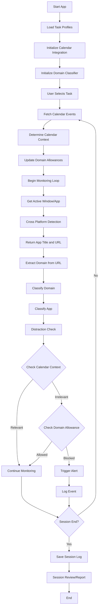

# FocusGuard – High Level Process Flow Diagram

**Legend:**
- **Rectangles**: Modules or major steps
- **Diamonds**: Decision points
- **Arrows**: Data/control flow

## Key Components

### Calendar Integration
- **Initialize Calendar Integration**: Sets up connection to calendar services (Google Calendar)
- **Fetch Calendar Events**: Retrieves upcoming and current calendar events
- **Determine Calendar Context**: Identifies context (meeting, focus, break) from events
- **Update Domain Allowances**: Sets domain allowance rules based on calendar context

### Activity Monitoring
- **Get Active Window/App**: Detects currently active application
- **Extract Domain from URL**: Parses domains from browser URLs
- **Classify Domain**: Categorizes domains (work, social, entertainment, etc.)
- **Classify App**: Categorizes applications by purpose

### Distraction Detection
- **Check Calendar Context**: Determines if activity is relevant to current calendar context
- **Check Domain Allowance**: Verifies if domain is allowed in current context
- **Trigger Alert**: Notifies user of distraction based on context and domain rules

## Module Reference

- **calendar_integration.py**: Google Calendar API client
- **calendar_context.py**: Calendar event parsing and context detection
- **calendar_domain_allowance.py**: Context-based domain filtering
- **domain_classifier**: Domain categorization and filtering
- **activity_monitor**: Cross-platform window/app detection
- **distraction_detector**: Combines all signals to detect distractions

---

This diagram provides a north star for understanding the overall architecture and flow of FocusGuard, including the calendar-based domain allowance system.
