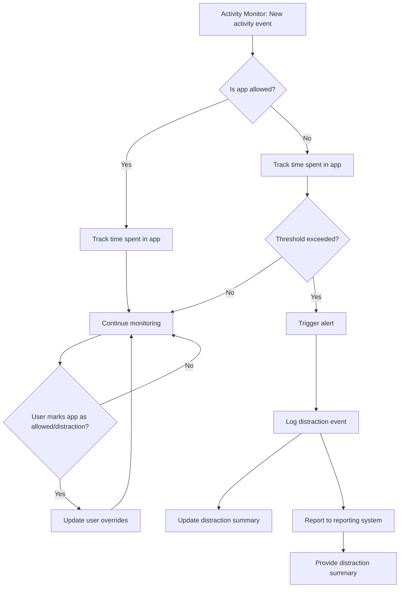

# Distraction Detector Flow Diagram

---

**Legend:**
- Activity events are received from the activity monitor.
- Allowed/disallowed status is determined by config, user overrides, and fuzzy matching.
- Time spent is tracked for each app/process.
- Alerts are triggered if distraction thresholds are exceeded.
- User can mark apps as allowed or distractions, updating future behavior.
- All events can be logged and reported.
